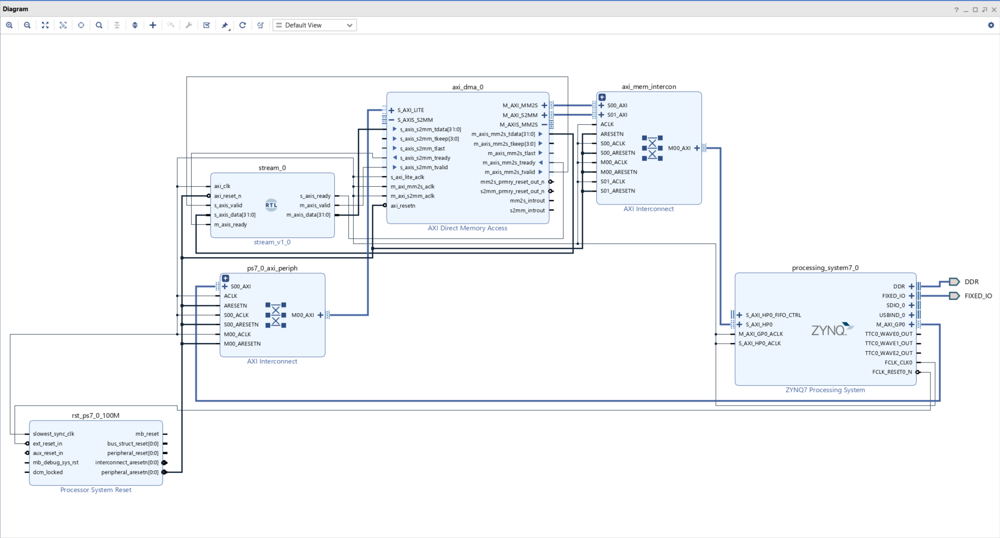
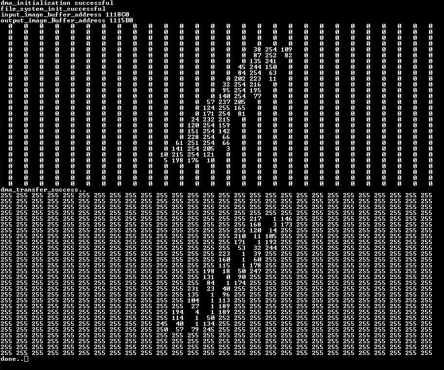

# DMA-Based Image Processing on Zybo FPGA

## Overview
This project demonstrates a **DMA-based image processing pipeline** implemented on the **Zybo FPGA development board**. The system reads image data from an SD card, processes it using a custom streaming IP core, and stores the processed output back in the SD Card.

## System Description
The following steps outline the complete data flow of the system:

1. **Image Storage**
   - Image files are stored on an **SD card** connected to the Zybo board.

2. **SD Card to DDR Transfer**
   - The images are read from the SD card and loaded into **DDR memory** using the processing system.

3. **DMA Transaction**
   - The **AXI-DMA IP** is configured to transfer image data from DDR memory to a **custom AXI-Stream IP block**.

4. **Custom Stream IP Processing**
   - The custom IP receives pixel values via AXI-Stream.
   - Each input pixel value is **negated** inside the IP.
   - The processed pixel stream is sent back to the DMA.

5. **DMA Write-Back**
   - The DMA stores the processed (negated) image data back into **DDR memory**.
6. **SD Card Write-Back**
   - The DMA stores the processed (negated) image data back into **DDR memory**.

6. **Output Verification**
   - Using **Tera Term**, the image data is printed:
     - After reading from DDR (original image)
     - After processing (negated image)
   - This allows verification of correct DMA operation and image processing.

## Block Design

## Tools & Hardware
- **Hardware**: Zybo FPGA Development Board  
- **Interfaces**: AXI, AXI-Stream, DDR, SD Card  
- **Terminal**: Tera Term  
- **Language/Environment**: C (PS), Verilog/SystemVerilog (Custom IP)

## Results
